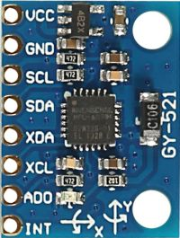
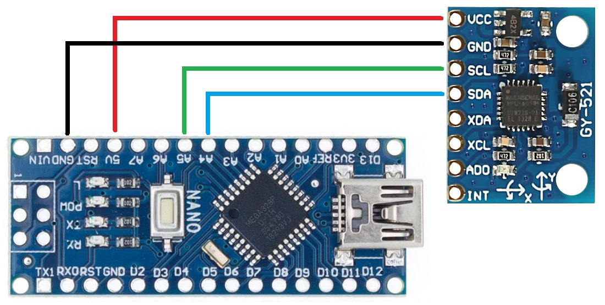
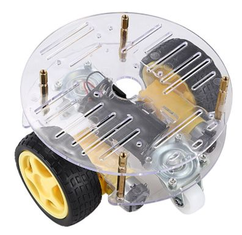

# MPU6050
Arduino library for the MPU6050 accelerometer and gyroscope sensor with I2C interface from InvenSense.

## Introduction
The MPU6050 is a motion tracking [device](https://www.invensense.com/products/motion-tracking/6-axis/mpu-6050/) 
from InvenSense. It is I2C controlled, contains a 3-axis gyroscope and a 3-axis Accelerometer (and a thermometer). 
InvenSense has published a
[datasheet](https://43zrtwysvxb2gf29r5o0athu-wpengine.netdna-ssl.com/wp-content/uploads/2015/02/MPU-6000-Datasheet1.pdf)
but for driver development, the 
[register map](https://43zrtwysvxb2gf29r5o0athu-wpengine.netdna-ssl.com/wp-content/uploads/2015/02/MPU-6000-Register-Map1.pdf)
is also crucial.

### Background
An [accelerometer](https://en.wikipedia.org/wiki/Accelerometer) is a device that measures acceleration. 
For example, an accelerometer at rest on the surface of the Earth will measure an acceleration due to 
Earth's gravity of g ≈ 9.81 m/s2. In a typical implementation a mass is hung with one degree of freedom;
it moves due to acceleration. Accelerometers are used in mobile phone and digital cameras so that images 
on screens are always displayed upright. Accelerometers are used in drones for flight stabilisation and 
for drop detection.

A [gyroscope](https://en.wikipedia.org/wiki/Gyroscope) is a device used for measuring or maintaining orientation.
A typical implementation is a spinning wheel in which the axis of rotation is free to assume any orientation by itself. 
Applications of gyroscopes include  navigation systems.

Gyroscope suffer from drift, so accelerometers are used to compensate for that.

### Acknowledgements

This project was built upon
 - [Simple-MPU6050-Arduino](https://github.com/Th-Havy/Simple-MPU6050-Arduino)
 - [Direction](https://howtomechatronics.com/tutorials/arduino/arduino-and-mpu6050-accelerometer-and-gyroscope-tutorial)
 - [NXP app note](https://www.nxp.com/files-static/sensors/doc/app_note/AN3461.pdf)


### This project
This project implements an Arduino library for the MPU6050. It comes with some examples.

Note that the MPU6050 requires a supply voltage of 3.3V. So, Arduino's 5.0V *not* OK. 
However, some boards, like the GY521 have an on-board voltage regulator and level shifter.



## Getting started

These steps are discussed in details below

 - Make sure you have a microcontroller and a sensor, and wire them together
 - Make sure you have the Arduino IDE and install this library
 - Open, compile, flash and run one of the examples


### Hardware

The hardware steps to take

 - You need an Arduino, e.g. an [Arduino Nano](https://store.arduino.cc/arduino-nano).
   I got a cheap [clone](https://www.aliexpress.com/item/4000427291663.html) with a USB micro plug.
 - You need an MPU6050. I got a [GY521 breakout board](https://www.aliexpress.com/item/4000504535389.html)
   with a 5V to 3V regulator.
 - You need to connect them. This library is simple; it only uses the I2C lines. So 4 wires are needed.
   I did not add pull-ups, the ones inside the Nano appear sufficient.
   


### Software

The software steps to take

 - It is assumed that you have the Arduino IDE installed. If not, refer to "Install the Arduino Desktop IDE" 
   on the [Arduino site](https://www.arduino.cc/en/Guide/HomePage). If you follow the default install, libraries
   will install here `C:\Users\maarten\Documents\Arduino\libraries` (for me, Maarten).
 - Install this library
    - Visit the project page for the [Arduino MPU6050 library](https://github.com/maarten-pennings/MPU6050).
    - Click the green button `Clone or download` on the right side, and from the pop-up choose Download ZIP.
    - Start Arduino, select from menu `Sketch > Include Library > Add .ZIP Library...` and select the just downloaded ZIP file. 
    - An alternative to the last step is to manually add the library: 
      Unzip the file "Here", and copy the entire tree to the Arduino library directory. This `README.md` should 
      be located at e.g. `C:\Users\maarten\Documents\Arduino\libraries\MPU6050\README.md`.

### Example

Running the example 

 - Restart the Arduino IDE and `Open File > Example > Examples from Custom Libraries > MPU6050 > basic`.
 - Make sure `Tools > Board` has `Arduino Nano`, `Tools > Processor` has the right bootloader (old for me), and
   `Tools > Port` has the correct COM port.
 - Select `Sketch > Upload` to compile and upload the example to the Nano.
 - Open the ` Tools > Serial Monitor` (at 115200 baud) and see the output
 
```
Welcome to the MPU6050 basic example
Driver version 1.0
MPU6050: sensor is ... present
MPU6050: success
 ae=0 ax=0.28 ay=-0.23 az=9.67 / ge=0 gx=0.05 gy=0.07 gz=0.00 / de=0 dx=0.23 dy=0.33 dz=0.01 / te=0 tt=23.35
 ae=0 ax=0.29 ay=-0.20 az=9.67 / ge=0 gx=0.15 gy=-0.01 gz=-0.07 / de=0 dx=0.23 dy=0.33 dz=0.01 / te=0 tt=23.35
 ae=0 ax=0.24 ay=-0.23 az=9.73 / ge=0 gx=0.09 gy=0.08 gz=-0.06 / de=0 dx=0.23 dy=0.34 dz=0.01 / te=0 tt=23.31
 ae=0 ax=0.28 ay=-0.26 az=9.73 / ge=0 gx=-0.04 gy=0.03 gz=0.06 / de=0 dx=0.22 dy=0.33 dz=0.01 / te=0 tt=23.35
 ae=0 ax=0.28 ay=-0.23 az=9.68 / ge=0 gx=0.07 gy=0.08 gz=-0.02 / de=0 dx=0.23 dy=0.33 dz=0.01 / te=0 tt=23.31
 ae=0 ax=0.28 ay=-0.19 az=9.69 / ge=0 gx=0.07 gy=-0.06 gz=0.06 / de=0 dx=0.24 dy=0.33 dz=0.01 / te=0 tt=23.26
 ae=0 ax=0.22 ay=-0.26 az=9.65 / ge=0 gx=0.03 gy=0.02 gz=-0.14 / de=0 dx=0.22 dy=0.35 dz=0.01 / te=0 tt=23.21
 ae=0 ax=0.26 ay=-0.25 az=9.69 / ge=0 gx=-0.08 gy=0.20 gz=0.14 / de=0 dx=0.22 dy=0.34 dz=0.01 / te=0 tt=23.35
 ae=0 ax=0.29 ay=-0.28 az=9.61 / ge=0 gx=-0.04 gy=-0.12 gz=-0.07 / de=0 dx=0.22 dy=0.33 dz=0.01 / te=0 tt=23.40
 ae=0 ax=0.26 ay=-0.26 az=9.67 / ge=0 gx=0.02 gy=-0.04 gz=-0.04 / de=0 dx=0.22 dy=0.34 dz=0.01 / te=0 tt=23.45
 ae=0 ax=0.21 ay=-0.26 az=9.59 / ge=0 gx=-0.05 gy=0.03 gz=0.07 / de=0 dx=0.22 dy=0.35 dz=0.01 / te=0 tt=23.45
 ae=0 ax=0.24 ay=-0.27 az=9.66 / ge=0 gx=0.00 gy=0.00 gz=0.13 / de=0 dx=0.22 dy=0.34 dz=0.01 / te=0 tt=23.40
 ae=0 ax=0.26 ay=-0.25 az=9.61 / ge=0 gx=0.02 gy=-0.01 gz=-0.13 / de=0 dx=0.22 dy=0.34 dz=0.01 / te=0 tt=23.31
 ae=0 ax=0.29 ay=-0.24 az=9.67 / ge=0 gx=0.07 gy=0.12 gz=-0.09 / de=0 dx=0.23 dy=0.33 dz=0.01 / te=0 tt=23.31
```

Notes on the example
 - On the first line see a general banner for the example application
 - On the second line see the actual version of this library (your might be newer)
 - On the third line, the application checks if the MPU6050 is present (correctly connected).
   Unfortunately, the Arduino I2C library does not feature a time-out (or a very long one) 
   when an I2C device is not responding.
   So if it takes a forever for the `present` to appear, you likely have a connection problem.
 - The next line (with `success`) gives the status of the `MPU6050.begin()` call.
   This call wakes-up the device, configures it, calibrates it.
   If it does not say `success` you have a problem.
 - Every next lines shows feedback from one measurement, showing details of the 4 sensors inside the MPU6050.
 - The first block shows the *a*ccelerator data.
    - `ae` should be 0, otherwise there was an I2C `error` when reading the accelerator data.
    - `ax` is the acceleration in x-direction (in m/s²).
    - similarly `ay` and `az` are the acceleration in y-direction respectively z-direction.
    - note that indeed `az` is about 9.81, earth's gravity.
 - The second block shows the *g*yroscope data.
    - `ge` should be 0, otherwise there was an I2C `error` when reading the gyroscope data.
    - `gx` is the angular rate in x-direction (in °/sec).
    - similarly `gy` and `gz` are the angular rate in y-direction respectively z-direction.
    - note that all these are typical (calibrated to be) 0 as long as the sensor is stationary.
 - The third block is _computed_ from the previous two. It computes the roll, pitch, and yaw *d*irection.
    - `de` should be 0, otherwise there was an I2C `error` when reading the accelerometer or gyroscope data.
    - `dx` is the roll (in °).
    - similarly `dy` and `dz` are the pitch and yaw.
    - note that all these are typical (calibrated to be) 0 as long as the sensor is stationary.
 - The fourth block shows the _t_emperature data.
    - `te` should be 0, otherwise there was an I2C `error` when reading the temperature data.
    - `tt` is the temperature (in °C).
    
## Other examples

There are also three use-case examples. 

The [Rotate](examples/Rotate) example shows how to keep track of your direction.
For example in a [robot](https://nl.aliexpress.com/item/4000349560940.html) with two independent 
(left and right) motors, it is hard to drive straight: the motors in practive have different speeds
and different slip.

.

The [Shake](examples/Shake) example shows how to detect shaking the sensor,
by just looking at the accelorator data.

The most elaborate example is [PID](examples/Pid).
It uses a PID controller to go straight.
See this [video](https://youtu.be/anDGpxeQeNc) for a demo.
Or [this one](https://youtu.be/pTtPlrXje0I) where the robot runs in "squares".

(end of doc)


    
 
 
 
